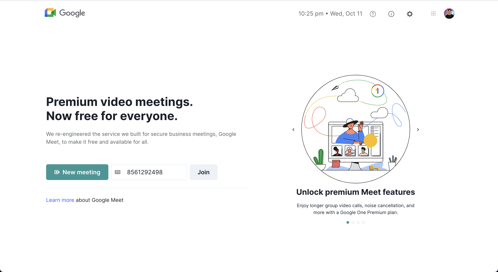
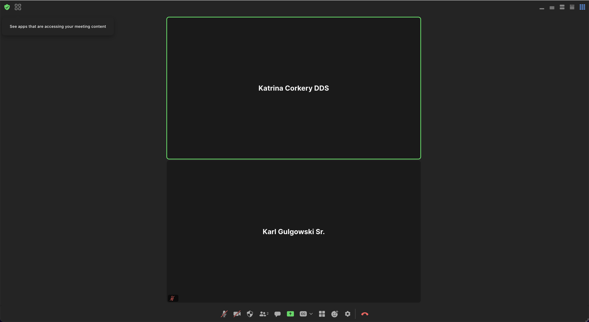

# Zoom app

Zoom meeting is the place where you meet and join with your friends immediately without login on. There is the project that I am researching and working on Zoom SDK on my business. Happy to share/contribute. Check out [meet-zoom.vercel.app](meet-zoom.vercel.app)





## Requirement

```
nvm use 18
```

## Develop

Before you get starting, please create `.env.goat`. Fill out env key in file `env.goat`

<pre>
ZOOM_CLIENT_ID=
ZOOM_SDK_KEY=ZOOM_CLIENT_ID
ZOOM_CLIENT_SECRET=
ZOOM_SECRET_TOKEN=
</pre>

## Installation

```
npm i
```

## Run React App

```
npm run dev:goat
```

## Generate token

We can generate token from client side but it is not safe for us to disclose the app key, so we will create the Nodejs server that returns a token. Here is [the example](./API.md)
